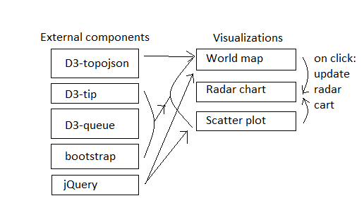

# Influences on the quality of education
## Kevin Vuong 10730141

## Data sources

###### Pisa scores
https://data.oecd.org/pisa/reading-performance-pisa.htm  
https://data.oecd.org/pisa/mathematics-performance-pisa.htm  
https://data.oecd.org/pisa/science-performance-pisa.htm

###### Teacher salaries
https://data.oecd.org/eduresource/teachers-salaries.htm

###### Education spending
https://data.oecd.org/eduresource/education-spending.htm

###### GDP per country
https://data.oecd.org/gdp/gross-domestic-product-gdp.htm

For the world map, we use the following template: http://bl.ocks.org/micahstubbs/8fc2a6477f5d731dc97887a958f6826d
Because this template reads data in as a tsv file, we have to convert the OECD data into the tsv format.

No major changes to the data need to be made for it to be usable for the scatterplot.

For the radar chart, we use the following template: http://bl.ocks.org/nbremer/21746a9668ffdf6d8242
No major changes need to be made, each value has to be updated according to the country that is checked for.

## Overview of technical components

## Descriptions

- To create the world map, we use D3-topojson
- To add tooltips to all visualizations, D3-tip is used
- D3-queue is used to apply the multiple data sources
- Bootstrap is used for the front-end work of the app
- jQuery is used to add interactivity in the form of dropdowns and sliders.
- To link visualizations with each other, we make use of event listeners like "mouseclick" or "mouseover", which is built in D3

## List of APIs or D3 plugins

See diagram
