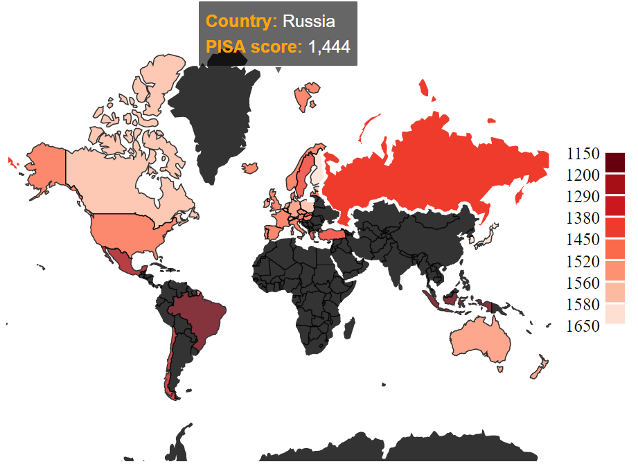

# Day 1

- Added world map based on PISA accumulated score
- Tooltip shows the exact score of the country when hovering above a country
so the viewer knows what the country has scored
- Legend shows which color belongs to the range of scores to better understand the world map

# Day 2

- Added slider, world map data gets updated through the slider
- Added static radar chart
