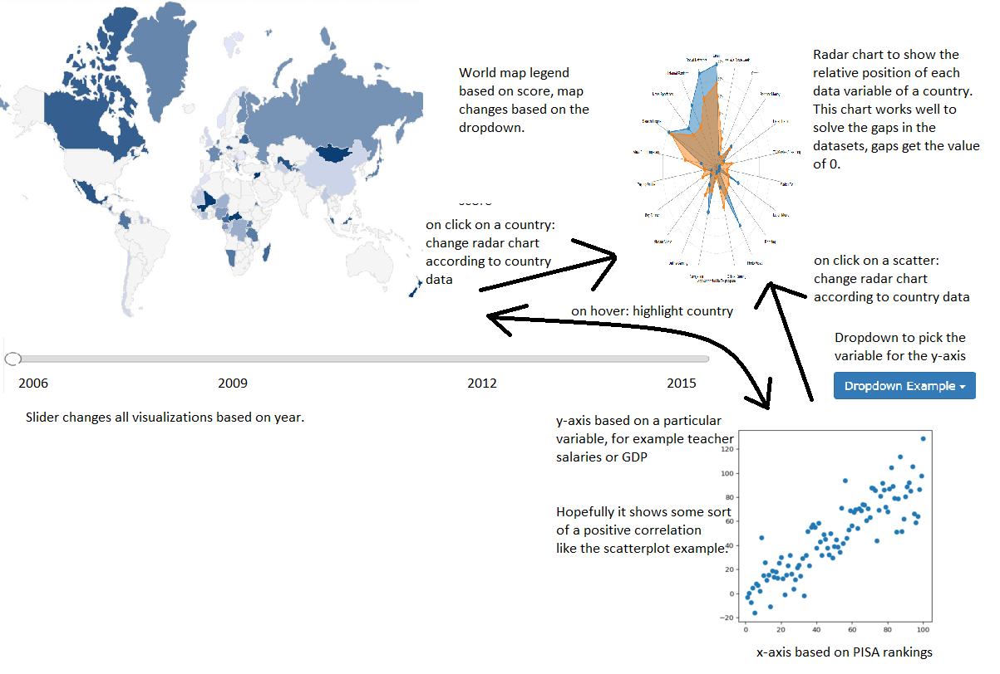
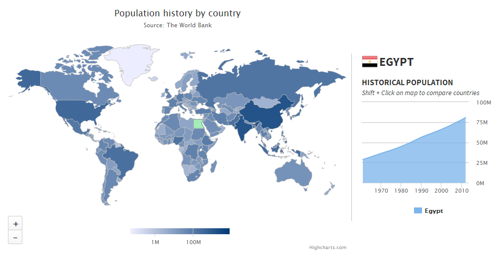

# Influences on the quality of education
## Kevin Vuong 10730141

## Problem statement
Every country differs from quality of education.
For example, given the PISA index in 2015, Singapore scored way higher than Tunisia in every aspect.
Striking is the fact that the richer countries score higher than the poorer countries.
By making an interactive visualization of possible factors for example education spending, GDP or teacher salaries,
we try to show that investing into education has a positive effect on the quality of education.

## Solution

##### Summary
The main visualization is the world map based on the PISA accumulated score for it's legend,
views linked to this visualization get updated by clicking on a country.

##### Sketch

##### Main features
- Different event listeners like onclick and hover (MVP)
- Dropdown to pick which year you want to look for

## Prerequisites

### Data sources

###### Pisa scores
https://data.oecd.org/pisa/reading-performance-pisa.htm
https://data.oecd.org/pisa/mathematics-performance-pisa.htm
https://data.oecd.org/pisa/science-performance-pisa.htm

Calculate PISA accumulated score to define the country map.

###### Teacher salaries
https://data.oecd.org/eduresource/teachers-salaries.htm

###### Education spending
https://data.oecd.org/eduresource/education-spending.htm

###### GDP per country
https://data.oecd.org/gdp/gross-domestic-product-gdp.htm

### External components
- D3-queue to evaluate asynchronous tasks with configurable concurrency
- D3-tip to include tooltips
- bootstrap for the front-end web framework

### Similar related visualization

The world map is based on population instead of the PISA score but the idea is essentially the same.
Like my proposal, the world map can be updated through time and the area chart gets updated when clicked on a country. All of this should be possible to implement through D3.

### Hardest parts
- No experience in creating a world map, especially getting it colored according to a legend
- Not all data is available for some certain countries creating holes in the visualizations
