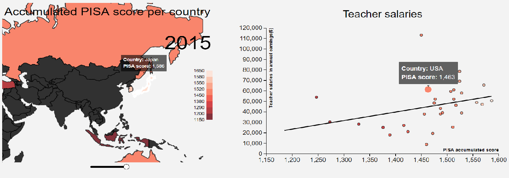
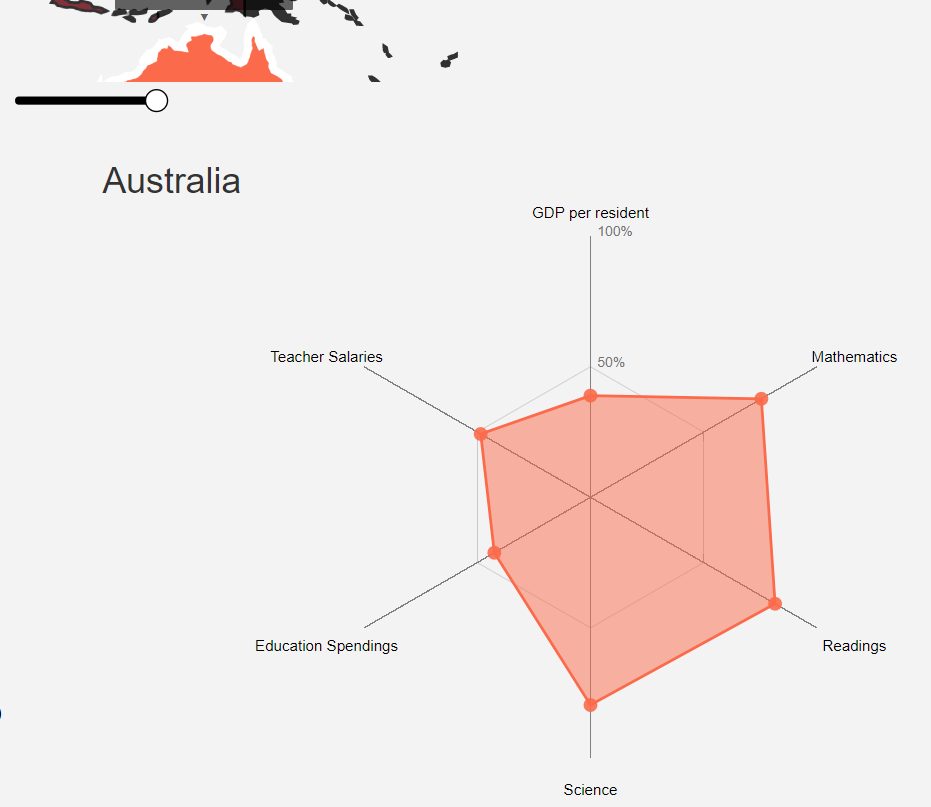

# The global difference in quality of education
## Kevin Vuong 10730141

https://kevinvuongly.github.io/programmeerproject/project/templates/index.html

## Problem statement
Every country differs from quality of education.
For example, given the PISA index in 2015, Singapore scored way higher than Indonesia in every aspect.
Striking is the fact that the richer countries score higher than the poorer countries.
By making an interactive visualization of possible factors for example education spending, GDP or teacher salaries,
we try to show that investing, directly and indirectly, into education has a positive effect on the quality of education.

## Solution

##### Summary
The main visualization is the world map based on the PISA scores for it's legend.
The radar chart gets updated by clicking either on a country on the world map or on a scatter point in the scatterplot.
The scatterplot with regression line is used to view for positive correlations.

##### Screenshots

##### Main features
- Event listener for hover to show extra information of the country
- Event listener for on click to update radar chart according to the country clicked for
- Slider to change every visualization according to the year picked for
- Dropdown to update the scatterplot according to the subject picked for

## Prerequisites

### Data sources

###### Pisa scores
https://data.oecd.org/pisa/reading-performance-pisa.htm  
https://data.oecd.org/pisa/mathematics-performance-pisa.htm  
https://data.oecd.org/pisa/science-performance-pisa.htm

###### Teacher salaries
https://data.oecd.org/eduresource/teachers-salaries.htm

###### Education spending
https://data.oecd.org/eduresource/education-spending.htm

###### GDP per country
https://data.oecd.org/gdp/gross-domestic-product-gdp.htm

### External components
- [Bootstrap](https://getbootstrap.com/) - The web framework used for front-end (under MIT License)
- [D3, including queue() and topojson](https://github.com/d3/d3) - Library used to create dynamic visualizations (under BSD 3-Clause "New" or "Revised" License)
- [jQuery](https://jquery.org) - The web framework used for handle events (under MIT License)

### External code
Acknowledgements to the following people for creating the code I've used:

- [Lulkafe](https://bl.ocks.org/Lulkafe/3832d628340038d9484fbd9edb705e01) for the slider
- [nmbremer](http://bl.ocks.org/nbremer/6506614) for the excellent radar chart(under MIT License)
- [HarryStevens](https://bl.ocks.org/HarryStevens/be559bed98d662f69e68fc8a7e0ad097) for the function to determine the regression line in the scatterplot(under GNU License, version 3)

## License
This project is licensed under the The Unlicense - see the [LICENSE](LICENSE) file for details
