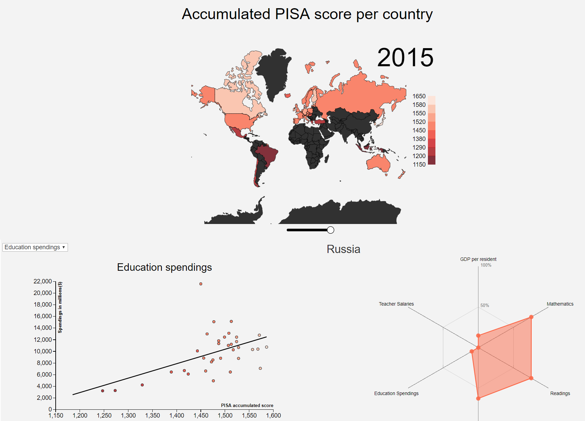

# The global difference in quality of education
## Kevin Vuong 10730141

## Application description
The goal of the application is to show the impact of investing into education has
on the quality of education e.g. the performance of a student.
The world map shows the geographical difference in quality of education expressed in the PISA score.
To get into more detail, the scatterplot and the radar chart try to show the positive effects of investing into education.

## Technical components

### High level overview
#### World map
The world map is created according to the accumulated PISA score per country. By clicking on a country gets the radar chart updated to the country.

#### Radar chart
The radar chart shows a relative score for each variable. The scores are calculated by looking at the position of the variable between the minimum and maximum of the available data;  

score(x) = (x - x[min]) / (x[max] - x[min])  

x[min]: the minimum value of the variable  
x[max]: the maximum value of the variable

#### Scatterplot
The scatterplot plots the accumulated PISA score in the x-axis and a variable, which is picked by using the dropdown, in the y-axis. By drawing a regression line there is a clear finding to be made wether the correlation is positive or negative. Just like with the world map, by clicking on a scatterpoint updates the radar chart.

### Files and functions
##### main.js
In this file, all the visualizations ultimately happen. Here is where all the visualizations are called for.
The functions that this file calls for are listed on other .js files which are listed below.
THe functions __updateData__, which obviously updates the data formatting, and __updateRadarValues__, which updates the values needed for the radar chart, in the main file.
Both functions will be called for when the user picks a year out through the slider.

##### slider.js
This file contains external code that I used to construct the slider.

##### d3-tip.js
This file contains external code that I used to construct the tooltip.

##### scatterplot.js
This file contains all global variables and interactivity functions needed for the scatterplot.
- __getMinimum__ function is used to determine the ranges of the datasets. It ignores an element if it is irrelevant. In my case, the element is irrelevant if it has the value of 0 which means that the data isn't available for that given country.
- __calcLinear__ function calculates the regression line according to the data provided.
- __updateScatter__ function updates the scatterplot to it's new values.
- __drawRegression__ function draws the regression line. This should be called for immediately after the calcLinear is called for.

##### radarchart.js
This file contains all global variables and functions needed for the radar chart.
- __createMin__ function is used to get the minimum value of an array. This function is linked with the getMinimum function in scatterplot.js.
- __createMax__ function does exactly the same as createMin with the difference that it is used to get the maximum value of the array.
- __draw__ is the external code that draws the radar chart.

## Challenges and decisions
A huge challenge that I met was concerning the code quality. I had a really hard time to adjust the code to local variables while trying to keep the unit interface small. What I've learned is the importance of using objects, this way I managed to keep the unit interface as small as possible. The other issue concerning local variables that I have with my code is that all the visualizations take place in the main javascript file. I'd rather have each visualization in a separate javascript file and this would be something that I would've dealt with if I had more time.

Another issue I had was concerning gaps in the data. I decided to create an object specifically for countries that had the most important data available: the PISA score. Countries whose PISA score are unknown would automatically be filtered for. Concerning other variables, I listed the value as 0, which I can easily ignore by using conditions. This way I don't have to deal with literally every country on the world concerning the other visualizations than the world map. If I had more time available, I'd rather create a general object instead of a separate object of each dataset. This way I can let my code deal with multiple datasets without having to constantly change my code.
